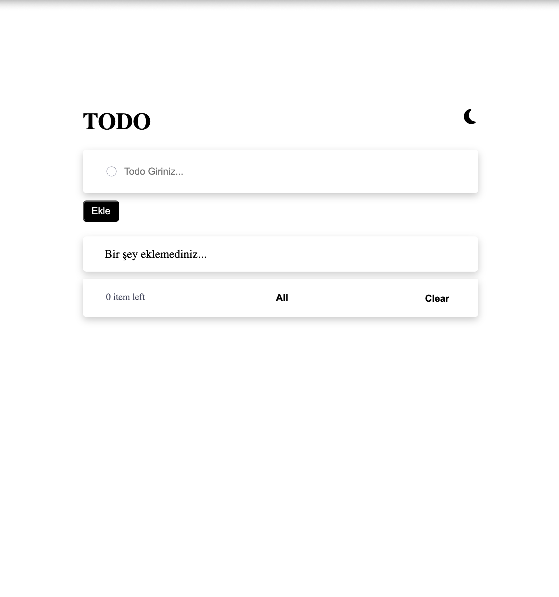

# Todo app




## Welcome! 👋

To do this project, you need a basic understanding of HTML,CSS, Javascript, React, Redux, Typescript.

## Technologies Used

React (Frontend)
Redux (State Management)
Typescript
CSS (Styling)
React Icons (For Icons)

## The Project

Your challenge is to build out this todo app and get it looking as close to the design as possible.

Your users should be able to:

- View the optimal layout for the app depending on their device's screen size
- See hover states for all interactive elements on the page
- Add new todos to the list
- Mark todos as complete
- Delete todos from the list
- Filter by all/active/complete todos
- Clear all completed todos
- Toggle light and dark mode


## Building your project

- Start by cloning the project from GitHub to your local machine:
```bash
git clone https://github.com/YourUsername/todo-list-application.git
```
- Navigate to the project directory and install the necessary dependencies by running the following command:
```bash
cd todo-list-application
```
```bash
npm install
```
- Once the dependencies are installed, you can start the development server to run the application locally:
```
```bash
npm start
```

<<<<<<< HEAD
- And You can start
=======
- And You can start
>>>>>>> a8e03b6 (Initial commit)
